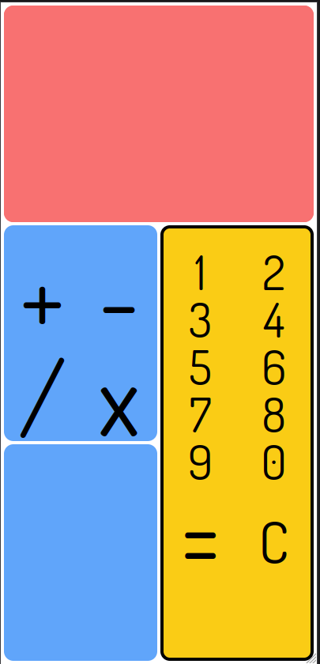

<h1> Calculator </h1>

A calculator with minimum functionality and a bit of animation, you wouldn't __believe__ how smart I think I am just for figuring this one out. 

 

<h2>Live Page</h2>

Here's the live page : [LIVE CALCULATOR](https://kimjacobus.github.io/calculator/)

<h2>Technologies used</h2>

- `Bootstrap` 
front-end toolkit

- `Vite` 
compiler

<h2>Fonts used</h2>

fonts used from : googlefonts

- `Dosis`
By ___

- `Sofia`
By ___
 

<h2>Contact</h2>

- jacobus.kim@gmail.com

----

